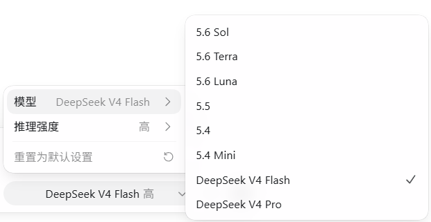

English | [中文](./README.md)

# codex-gateway

**Give Codex the brains of GPT and the value of DeepSeek — switch with one click mid-conversation, context preserved, task uninterrupted.**

<div align="center">
  
</div>

A local gateway written in Rust (single exe, zero runtime dependencies). Codex points its `config.toml` at the gateway, which routes requests to OpenAI or DeepSeek based on the `model` field — no protocol conversion, SSE streams passed through as-is.

## How It Works

```
              ┌────────────────────────────────────────────┐
 Codex ─────► │ codex-gateway (127.0.0.1:17899)            │
              │  Routes by model:                          │
              │   deepseek-* ──► https://api.deepseek.com   │
              │   others (GPT)──► https://chatgpt.com/...   │
              └────────────────────────────────────────────┘
```

- Official requests pass through Codex's OAuth session — zero extra config
- DeepSeek requests swap in your API Key
- A merged model catalog makes both GPT and DeepSeek models appear in Codex's menu

## Commands

| Command     | Description                                  |
| ----------- | -------------------------------------------- |
| `setup`     | Interactive wizard (API Key, model selection, port) |
| `start`     | Start gateway, switch to DeepSeek mode       |
| `stop`      | Stop gateway, switch back to native GPT (sessions preserved) |
| `status`    | Show status & upstream connectivity          |
| `uninstall` | Full uninstall (removes config & backups, sessions preserved) |

**`stop` vs `uninstall`:** `stop` keeps gateway data so `start` switches back instantly; `uninstall` wipes everything, requiring `setup` again. Neither deletes `~/.codex/` session history.

## Quick Start

```powershell
# 0. cd to the project directory (where the exe lives)

cd c:\Codex无缝接私有API

# 1. Configure (one-time)

.\target\release\codex-gateway.exe setup

# 2. Start

.\target\release\codex-gateway.exe start

# 3. Restart Codex — switch between GPT / DeepSeek from the model menu
```

Daily switching:

```powershell
.\target\release\codex-gateway.exe stop    # Switch back to native GPT
.\target\release\codex-gateway.exe start   # Switch back to DeepSeek
```

## How to Get a DeepSeek API Key

1. Go to [platform.deepseek.com](https://platform.deepseek.com), sign up / log in
2. Navigate to "API Keys", click "Create API Key"
3. Copy the generated Key (starts with `sk-`) and paste it into the `setup` wizard

> DeepSeek API is pay-as-you-go. New users typically receive free credits — enough for everyday use.

## License

MIT
